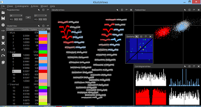

KlustaViewa
===========

*KlustaViewa* is a software for semi-automatic spike sorting with high-channel count silicon probes. It streamlines the manual stage occurring after the automatic clustering stage by guiding the user through the clustered data, letting him or her refine the clusters. The goal is to make the manual stage more reliable, quicker, and less error-prone.

This software was developed by Cyrille Rossant in the [Cortical Processing Laboratory](http://www.ucl.ac.uk/cortexlab) at UCL.

User guide
----------

  * [See the user guide here](https://github.com/klusta-team/klustaviewa/blob/master/docs/manual.md).

Screenshots
-----------

Installation
------------

  * The software is in beta version at this time.
  * The installation procedure depends on your operating system.

### Windows 7/8 64 bits

#### Method 1 (preferred: full installer)

  * [Download the KlustaViewa Full Installer for Windows 64 bits (>200MB)](http://klustaviewa.rossant.net/klustaviewa-setup.exe).
  * Execute the installer.
  * Click on the *KlustaViewa* icon on your desktop or in the Start menu to launch the software.
  * To update the software at any time, execute *Update KlustaViewa* in the Start menu (you need an active Internet connection).
  
#### Method 2 (manual method)

  * Step 1: if you don't already have a Python installation, [download this ZIP file (72MB)](http://klustaviewa.rossant.net/klustaviewa-dependencies.zip) containing a full Python distribution (required by KlustaViewa).
  * Step 2: unzip the archive. You'll find several installers: execute them all one by one, in the right order.
  * Step 3: download the [KlustaViewa Light Installer for Windows 64 bits (<1MB)](http://klustaviewa.rossant.net/klustaviewa-0.1.0.dev.win-amd64-py2.7.exe) and execute it.
  * Step 4: you can launch the software with the shortcut named *KlustaViewa* on your desktop and in the start menu.

Once the software is installed, you can update it when a new version is available by doing again **Step 3** only.

### Ubuntu

  * Step 1: on Ubuntu, type in a shell:

        $ sudo apt-get install python2.7 python-numpy python-pandas python-matplotlib python-opengl python-qt4 python-qt4-gl python-distribute python-pip python-nose

  * Step 2: [download KlustaViewa](http://klustaviewa.rossant.net/klustaviewa-0.1.0.dev.zip) and extract the package.
  
  * Step 3: open a system shell in the directory where you extracted the package, and execute the following command:
  
        python setup.py install

  * Step 4: to run KlustaViewa, type the following command in a system shell:
  
        klustaviewa

### Mac OS X

  * Step 1: [install ActivePython][http://downloads.activestate.com/ActivePython/releases/2.7.2.5/ActivePython-2.7.2.5-macosx10.5-i386-x86_64.dmg). [Here is the link to the main website for your reference](http://www.activestate.com/activepython).
  
  * Step 2: to install the required Python packages, type in a shell:
  
        sudo pypm install numpy
        sudo pypm install pandas
        sudo pypm install matplotlib
        sudo pypm install pyopengl
        sudo pypm install pyqt4

  * Step 3: [download KlustaViewa](http://klustaviewa.rossant.net/klustaviewa-0.1.0.dev.zip) and extract the package.
  
  * Step 4: open a system shell in the directory where you extracted the package, and execute the following command:
  
        python setup.py install
  
  * Step 5: to run KlustaViewa, type the following command in a system shell:
  
        klustaviewa

Details
-------

### Dependencies
  
The following libraries are required:
  
  * Python 2.7
  * Numpy >= 1.7
  * Pandas >= 0.10
  * Matplotlib >= 1.1.1
  * PyOpenGL >= 3.0.1
  * either PyQt4 or PySide

### OpenGL
  
KlustaViewa requires OpenGL >= 2.1. To find out which version of OpenGL is available on your system:

  * Use [OpenGL Extensions Viewer](http://www.realtech-vr.com/glview/)
  * Alternatively, on Linux, run `glxinfo`.

KlustaViewa works better with a good graphics card as it uses hardware-accelerated visualization. With a lower end graphics card, the software will work but somewhat slower.

### Development version

Use this if you want to be able to update with `git pull` (you need git).

  * Clone the repository:
  
        git clone https://github.com/rossant/klustaviewa.git
  
  * Install KlustaViewa with `pip` so that external packages are automatically updated (like `qtools` which contains some Qt-related utility functions):
  
        pip install -r requirements.txt
        

### IPython 1.0.dev

If IPython 1.0.dev is installed, then you will have the possibility to open an IPython terminal in the context of the GUI. This lets you access all elements and data variables programatically. To install this version of IPython, do the following:

  * Ensure that any version of IPython is uninstalled.
  * Install pygments with `pip install pygments`
  * Execute the following commands:
  
        git clone https://github.com/ipython/ipython.git
        cd ipython
        python setupegg.py develop
  
Then, in the software, you will be able to open an interactive IPython shell (with pylab mode activated) in the Views menu. Type `%who` to see the list of available variables.

  
Troubleshooting
---------------

### Common errors in Windows

  * If you can't run `python` or `klustaviewa` in a console, you may need to add `C:\Python27\Scripts` in the PATH variable, as [described here](http://geekswithblogs.net/renso/archive/2009/10/21/how-to-set-the-windows-path-in-windows-7.aspx).

### Contact

If you have any trouble, bug, comment or suggestion:
  
  * You can [send a message on the Google group](https://groups.google.com/forum/?fromgroups#!forum/klustaviewas).
  * You can send an e-mail to the author of the software: cyrille *dot* rossant *at* gmail *dot* com.

