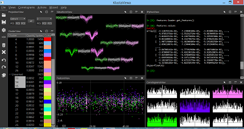

KlustaViewa
===========

*KlustaViewa* (previously *Spiky*) is a software for semi-automatic spike 
sorting with high-channel count silicon probes.
It is meant to be used after the automatic clustering stage.
This interface automatically guides the user through the clustered data and 
lets him or her refine the data. 
The goal is to make the manual stage more reliable, quicker, and less
error-prone.

This software was developed by Cyrille Rossant in the [Cortical Processing Laboratory](http://www.ucl.ac.uk/cortexlab) at UCL.

Installation
------------

The software is still in development, but you can download an experimental
version here.

### Step 1

You need Python 2.7 and a bunch of other common scientific packages.

  * Install [Python 2.7](http://python.org/download/) (available on Windows, OS X, or Linux),
    64 bits (recommended) or 32 bits.

For the external packages, the procedure depends on your system.

#### Windows

[Go on this webpage](http://www.lfd.uci.edu/~gohlke/pythonlibs/) and 
download:
    
  * Numpy >= 1.7
  * Pandas >= 0.10
  * Matplotlib >= 1.1.1
  * PyOpenGL >= 3.0.1
  * PyQt4
  * Distribute
  * (optional) Pip (for installing Python packages easily)
  * (optional) PyTables (for a future version which will support HDF5)
  * (optional) IPython (for interactive computing)
  * (optional) Nose (for unit tests)
  
For each package, be sure to choose the appropriate version (it should be
`*.win-amd64-py2.7.exe` for Python 64 bits, or `*.win32-py2.7.exe`
for Python 32 bits).

#### OS X

Go on [HomeBrew](http://mxcl.github.io/homebrew/) and install the packages
listed above.

#### Ubuntu >= 13.x

(Untested) Type in a shell:

    $ sudo apt-get install python2.7 python-numpy python-pandas python-matplotlib python-opengl python-qt4 python-qt4-gl python-distribute python-pip python-nose ipython

#### Ubuntu < 13.x

(Untested) Type in a shell:

    $ sudo apt-get install python2.7 python-matplotlib python-opengl python-qt4 python-qt4-gl python-distribute python-pip python-nose ipython
    $ sudo pip install numpy
    $ sudo pip install pandas
    
The reason is that old versions of Ubuntu do not provide packages for NumPy 1.7 and Pandas 0.10. Using `pip` means compiling the libraries directly, which may not work all the time. Another solution is to download the correct Ubuntu packages available for the latest Ubuntu distributions, and install them on the old Ubuntu.

### Step 2

[Download KlustaViewa.](http://klustaviewa.rossant.net/klustaviewa-0.1.0.dev.zip)

### Step 3

Extract this ZIP file in a temporary folder.

### Step 4

  * On Windows, double-click on `windows_install.bat`.
  * On other systems, open a system shell in the temporary directory where
    you extracted the package, and execute the following command:
    `python setup.py install`.

### Step 5

To run the software, execute `klustaviewa` in a system shell.

On Windows, you may need to add `C:\Python27\Scripts` in the PATH variable,
as [described here](http://geekswithblogs.net/renso/archive/2009/10/21/how-to-set-the-windows-path-in-windows-7.aspx).

Gallery
-------

Details
-------

### Dependencies
  
The following libraries are required:
  
  * Python 2.7
  * Numpy >= 1.7
  * Pandas >= 0.10
  * Matplotlib >= 1.1.1
  * PyOpenGL >= 3.0.1
  * either PyQt4 or PySide

More generally, we also recommend [pip](https://pypi.python.org/pypi/pip) and 
[IPython](http://ipython.org/) as they are commonly used for 
scientific computing with Python.
  
### OpenGL
  
For KlustaView, you need OpenGL >= 2.1. To find out which version of OpenGL 
you have:

  * Use [OpenGL Extensions Viewer](http://www.realtech-vr.com/glview/)
  * Alternatively, on Linux, run `glxinfo`.

KlustaViewa works better with a good graphics card as it uses
hardware-accelerated visualization. With a lower end graphics card, the
software will work but somewhat slower.

### Development version

Use this if you want to be able to update with `git pull` (you need git).

  * Clone the repository:
  
        git clone https://github.com/rossant/klustaviewa.git
  
  * Install KlustaViewa with `pip` so that external packages are automatically
    updated (like `qtools` which contains some Qt-related utility functions):
  
        pip install -r requirements.txt

  